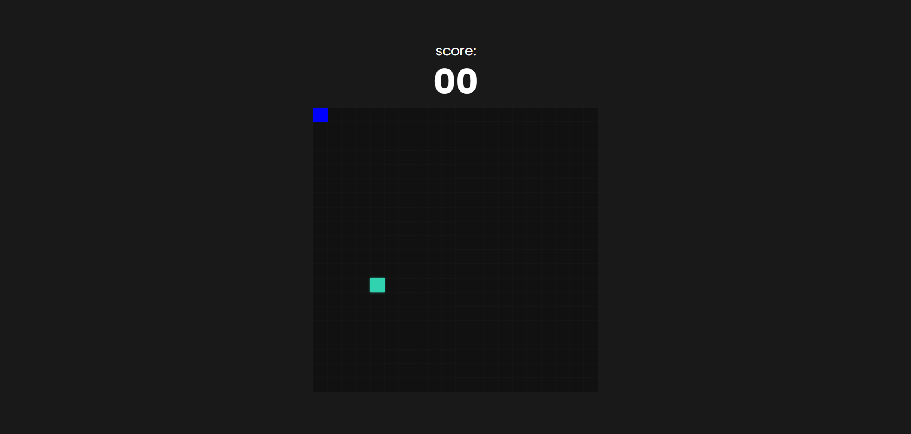

# snakeGame
<h1 align="center">Snake Game</h1>

Implementação do clássico jogo da cobrinha desenvolvido para prática de lógica de programação e desenvolvimento web. 

  <a href="#-tecnologias">Tecnologias</a>&nbsp;&nbsp;&nbsp;|&nbsp;&nbsp;&nbsp;
  <a href="#-projeto">Projeto</a>&nbsp;&nbsp;&nbsp;|&nbsp;&nbsp;&nbsp;
  <a href="#memo-licença">Licença</a>

  

 

 
    

## 🚀 Tecnologias

Nesse projeto foram utilizadas as seguintes tecnologias:

- CSS  
- HTML  
- JavaScript  
- Github  

## 💻 Projeto

Este projeto é uma implementação do clássico **Snake Game**, desenvolvido utilizando **HTML, CSS e JavaScript**, com base em um vídeo tutorial.

- [Visite o vídeo](https://www.youtube.com/watch?v=LyWSsZktVOg&list=WL&index=1)

O objetivo do projeto foi praticar conceitos importantes do desenvolvimento web, como **lógica de programação, manipulação do DOM, controle de eventos do teclado e atualização dinâmica da interface**.

Durante o jogo, o jogador controla a cobra pelo teclado, deve coletar a comida para aumentar a pontuação e evitar colisões com as bordas ou com o próprio corpo da cobra.

- [Visite o projeto online](https://helenapl145.github.io/snakeGame/)

## :memo: Licença

Esse projeto está sob a licença MIT.

---

Feito com ♥ by Helena Lima
